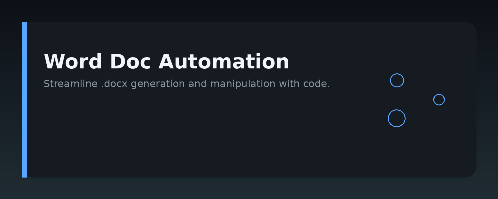
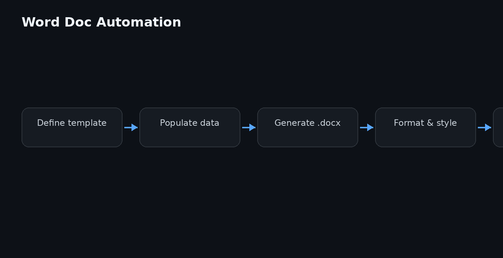

# Word Doc Automation




## Overview

Word Doc Automation is a practical guide to generating, editing, and managing Microsoft Word documents programmatically. It covers Python libraries (python-docx, docxtpl), command-line tools, and template-driven workflows for turning raw data into polished `.docx` files without manual copying and pasting.

The repo is a knowledge base: runnable examples, step-by-step recipes, and reference notes. It is not a library itself — it teaches you how to build your own automation around Word documents.

## Why it exists

Most teams still produce Word documents by hand: reports, proposals, contracts, meeting minutes. That is slow, error-prone, and hard to scale. Automating the boring parts — headings, tables, repeated paragraphs, data insertion — frees people for actual writing and review.

This guide exists because the scattered documentation for docx tooling is fragmented across library docs, blog posts, and Stack Overflow answers. Here you get one coherent path from a blank document to a fully generated report, with the reasoning behind each step.

## Core concepts

- **Document object model**: A `.docx` file is a zip archive of XML. Libraries like `python-docx` give you a high-level object model: `Document`, `Paragraph`, `Run`, `Table`, `Section`.
- **Templates**: Separate layout from content. Use `docxtpl` with Jinja2 placeholders (`{{ customer_name }}`) to fill in values without touching formatting.
- **Styles**: Define heading, body, and table styles once. Reuse them so output stays consistent across runs.
- **Merging and splitting**: Combine multiple documents or extract sections using the underlying `docx` package or `python-docx`'s `add_*` methods.
- **Conversion**: Word documents often need to become PDFs. Tools like `docx2pdf` or LibreOffice headless mode handle that.
- **Idempotency**: Rerunning a script should produce the same result. Keep templates and data inputs stable, and version them.

## Architecture

The workflow is a simple pipeline:

1. **Source data** — JSON, CSV, YAML, or a database query.
2. **Template** — a `.docx` file with placeholders and formatting.
3. **Automation script** — reads data, fills the template, and saves output.
4. **Output** — one or more `.docx` files, optionally converted to PDF.

```
data/            # sample input files (JSON, CSV)
templates/       # .docx templates with placeholders
scripts/         # Python automation scripts
output/          # generated documents (gitignored)
docs/            # extended notes and references
```

The pipeline is intentionally decoupled: swap the data source or the template without touching the script logic.

## Practical workflow

1. Create a template in Word with placeholders for dynamic content.
2. Write a Python script that loads the template and the data file.
3. Loop over records, filling placeholders and generating one document per record (or one combined document).
4. Optionally convert outputs to PDF.
5. Test with a small sample, then run on the full dataset.

Keep scripts idempotent: always write to a fresh output directory or overwrite with a timestamp.

## Examples

### Fill a simple template with `docxtpl`

```python
from docxtpl import DocxTemplate

doc = DocxTemplate("templates/report_template.docx")
context = {
    "customer_name": "Acme Corp",
    "order_total": 1250.00,
    "date": "2025-01-15",
}
doc.render(context)
doc.save("output/acme_report.docx")
```

### Generate a table from CSV data

```python
from docx import Document
import csv

doc = Document()
doc.add_heading("Sales Summary", level=1)

table = doc.add_table(rows=1, cols=3)
table.style = "Light Grid Accent 1"
hdr = table.rows[0].cells
hdr[0].text = "Region"
hdr[1].text = "Units"
hdr[2].text = "Revenue"

with open("data/sales.csv") as f:
    reader = csv.DictReader(f)
    for row in reader:
        cells = table.add_row().cells
        cells[0].text = row["region"]
        cells[1].text = row["units"]
        cells[2].text = row["revenue"]

doc.save("output/sales_table.docx")
```

### Add a header and footer

```python
from docx import Document
from docx.shared import Pt

doc = Document()
section = doc.sections[0]

header = section.header
header_para = header.paragraphs[0]
header_para.text = "Internal Report — Confidential"

footer = section.footer
footer_para = footer.paragraphs[0]
footer_para.text = "Page "
run = footer_para.add_run()
fld = run._element
# add PAGE field via XML (simplified)
from docx.oxml.ns import qn
from docx.oxml import OxmlElement
fldChar = OxmlElement("w:fldChar")
fldChar.set(qn("w:fldCharType"), "begin")
instrText = OxmlElement("w:instrText")
instrText.text = "PAGE"
fldEnd = OxmlElement("w:fldChar")
fldEnd.set(qn("w:fldCharType"), "end")
run._r.append(fldChar)
run._r.append(instrText)
run._r.append(fldEnd)

doc.save("output/with_header_footer.docx")
```

## FAQ

**Do I need Microsoft Word installed to run these scripts?**  
No. `python-docx` and `docxtpl` read and write `.docx` files directly. Word is only needed if you want to visually edit a template or preview output.

**Can I generate .doc files (the old format)?**  
Not directly with these libraries. Convert `.doc` to `.docx` first (Word or LibreOffice), then automate.

**How do I handle images in generated documents?**  
Use `doc.add_picture("path.png", width=Inches(6))` with `python-docx`. For templates, add a placeholder and replace it in code.

**What about formatting that breaks after rendering?**  
Keep placeholders inside a single run. If you split a placeholder across runs, `docxtpl` may fail to replace it. Edit templates carefully.

**Is this production-ready for large volumes?**  
For thousands of documents, batch processing works, but watch memory. Generate one document at a time and save immediately. For very large runs, consider a queue or a headless service.

## License

MIT License — see [LICENSE](LICENSE) for details.

Topic: `word-doc-automation`
